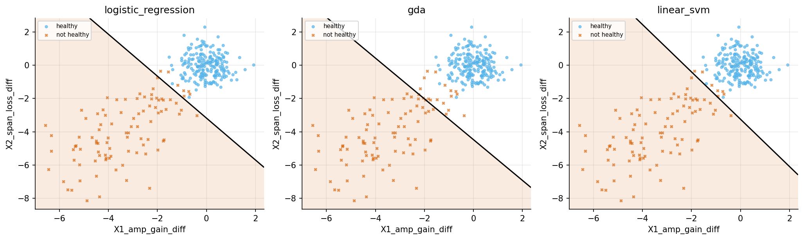
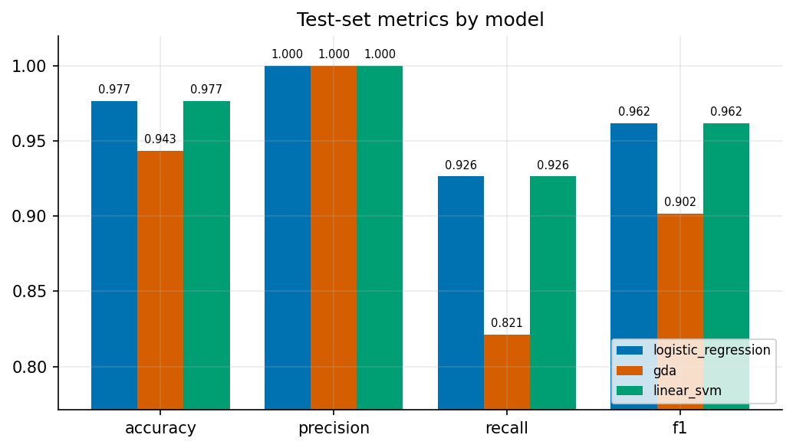

# Link Failure Prediction and Localization in Cloud Scale Networks using Supervised Learning

*An implementation inspired by Zahra Bakhtiari's Stanford work, packaged as `linkfail`.*

[](https://github.com/YOUR-USERNAME/linkfail/actions)


Predict whether an end-to-end optical link is **healthy** or **about to fail**, so traffic can be
rerouted *before* customers notice an outage. Point the tool at your own dataset, describe your
columns in a few lines of YAML (or command-line flags), and it trains, evaluates and saves three
linear classifiers, with figures and a report.

The method follows *"Link Failure Prediction and Localization in Cloud Scale Networks using
Supervised Learning"* (Z. Bakhtiari, Stanford): per-span amplifier-gain and span-loss deviations
from their baselines are summed along the link and fed to **logistic regression** (Newton's
method), **Gaussian Discriminant Analysis** and a **linear SVM**.



> **Heads-up on the numbers.** The paper's telemetry is proprietary, so everything in this README
> was produced on **synthetic** data from `python -m linkfail demo`. It proves the pipeline works;
> it says nothing about accuracy on your network. Train on your own data to get real figures.

**New here?** Read the plain-language guide: [`docs/HOW_IT_WORKS.md`](docs/HOW_IT_WORKS.md).

## Quick start

```bash
git clone https://github.com/YOUR-USERNAME/linkfail.git
cd linkfail
python -m venv .venv && source .venv/bin/activate      # Windows: .venv\Scripts\activate
pip install -e .

python -m linkfail demo          # trains on built-in synthetic data, writes runs/demo/
```

Open `runs/demo/report.md` and the PNGs in `runs/demo/figures/`.

## Use your own dataset

**Step 1 — look at your file** to find the column names:

```bash
python -m linkfail inspect --data my_data.csv
```

**Step 2 — pick the case that matches your data.**

*A. You already have feature columns and a 0/1 label (simplest — no YAML needed):*

```bash
python -m linkfail train --data my_data.csv --features X1 X2 --label label --out runs/exp1
```

*B. The label is text, e.g. several failure types (`no-failure`, `EDFA`, `NLI`, ...):*

```bash
python -m linkfail train --data my_data.csv --features osnr ber --label failure_class \
       --healthy-labels no-failure --out runs/exp2
```

*C. Raw per-span telemetry (the paper's setup).* Copy `configs/sample.yaml`, change the column
patterns, and run:

```bash
python -m linkfail train --data my_data.csv --config configs/my_config.yaml --out runs/exp3
```

More templates are in [`configs/`](configs). Supported formats: `.csv`, `.tsv`, `.parquet`
(parquet needs `pip install -e ".[parquet]"`).

**Step 3 — score new data with the trained model:**

```bash
python -m linkfail predict --model runs/exp1/model.joblib --data new_links.csv --output predictions.csv

# When the model used raw per-span derived features, also identify the most adverse span.
python -m linkfail predict --model runs/exp3/model.joblib --data new_telemetry.csv \
       --output predictions.csv --localize
```

The output has a `row_index`, an `unhealthy_score` (0–1) and a `prediction` per row. The new file
does not need a label column. With `--localize`, raw per-span configurations add `suspected_span`
and `localization_score`: the span with the largest adverse baseline deviation for each alerted row.

## What you get after training

```
runs/exp1/
├── model.joblib          all trained models + scaler + config (used by `predict`)
├── metrics.json          train and test metrics per model
├── report.md             readable summary: dataset, metrics table, learned coefficients
├── config_used.yaml      the exact settings, for reproducibility
└── figures/
    ├── confusion_matrices.png
    ├── metric_comparison.png
    ├── roc_curves.png
    └── decision_boundaries.png   (only when there are exactly 2 features)
```

## Example results (synthetic demo data)

900 training rows, 300 test rows, 2 engineered features:

| Model | Accuracy | Precision | Recall | F1 | ROC-AUC |
|---|---|---|---|---|---|
| Logistic regression (Newton) | 0.977 | 1.000 | 0.926 | 0.962 | 0.999 |
| Gaussian Discriminant Analysis | 0.943 | 1.000 | 0.821 | 0.902 | 0.999 |
| Linear SVM | 0.977 | 1.000 | 0.926 | 0.962 | 0.999 |

GDA trails the other two here for the same reason the paper gives: it assumes each class is a
Gaussian cloud, and the degraded links are not. Accuracy alone can mislead when failures are rare,
so recall (failures caught) and precision (false alarms avoided) are reported too.



## How it works

1. **Per-span diffs (paper Eq. 1).** `x1 = amp_gain − target_gain`, `x2 = target_span_loss − span_loss`.
2. **Sum along the link (Eq. 2).** `X1 = Σ x1`, `X2 = Σ x2` over all spans → one point per time bin.
3. **Clean.** Missing values are linearly interpolated (or median-filled / dropped).
4. **Split & scale.** Stratified 75 % / 25 % split; standardisation uses training statistics only.
5. **Train** three linear models; **evaluate** on the held-out 25 %.

| Model | Idea | Training |
|---|---|---|
| Logistic regression | models `p(unhealthy \| x)` directly | Newton's method, ~10 iterations |
| GDA | models each class as a Gaussian, applies Bayes' rule | closed-form, no iterations |
| Linear SVM | widest-margin straight line between classes | scikit-learn `SVC` |

## Configuration reference

All keys are optional except that you must define features and a label. Defaults live in
[`linkfail/config.py`](linkfail/config.py).

| Key | Meaning |
|---|---|
| `data.feature_columns` | numeric columns used as-is |
| `data.derived_features` | list of `{name, minuend, subtrahend}`; value = Σ over matched column pairs of `minuend − subtrahend`; wildcards like `amp_gain_*` allowed |
| `data.label_column` | column with the label (default `label`) |
| `data.positive_labels` / `data.healthy_labels` | which label values mean "not healthy" / "healthy" (use one) |
| `data.label_from_threshold` | `{column, below}` or `{column, above}`: derive the label from a number such as OSNR |
| `data.missing` | `interpolate` (default), `median` or `drop` |
| `data.sort_by` | column to sort by before interpolating, e.g. a timestamp |
| `split.test_size`, `split.seed`, `split.stratify` | split settings (0.25 / 42 / true) |
| `standardize` | scale features to mean 0, std 1 (default true) |
| `models` | subset of `logistic_regression`, `gda`, `linear_svm` |
| `model_params` | e.g. `{linear_svm: {C: 10}}` |

## Where to find datasets

- **Ghosh & Adhya optical soft-failure dataset** (Mendeley Data, CC BY 4.0, DOI `10.17632/y3pspy7j83.1`):
  756 lightpaths, four classes (no-failure, ECL, EDFA, NLI). Use `healthy_labels: ["no-failure"]`.
- **Network-And-Services/optical-failure-dataset** (GitHub): testbed telemetry with emulated soft and
  hard failures, including OSNR and per-amplifier metrics.

Check each dataset's licence and column names before use.

## Project layout

```
linkfail/            the package
  config.py          defaults, YAML loading, validation
  data.py            loading, cleaning, feature + label building
  models.py          logistic regression (Newton), GDA, linear SVM
  evaluate.py        metrics and report
  plotting.py        figures
  sample_data.py     synthetic telemetry generator
  cli.py             inspect / train / predict / demo
configs/             ready-to-copy YAML templates
tests/               pytest suite (29 tests)
data/sample/         bundled synthetic CSV
docs/                HOW_IT_WORKS.md guide + figures used in the docs
```

## Development

```bash
pip install -e ".[dev]"
pytest -q
```

CI runs the tests on Python 3.10–3.12 for every push (`.github/workflows/ci.yml`).

## Limitations

- Linear models only. If your data is not roughly linearly separable, add a non-linear model
  (the paper suggests an RBF-kernel SVM as future work).
- Binary task (healthy vs not healthy). Localization ranks the span with the strongest adverse
  configured baseline deviation; it is a diagnostic heuristic, not a separately validated
  root-cause classifier.
- Rows are treated as independent; there is no time-series modelling.

## Reference

Z. Bakhtiari, *Link Failure Prediction and Localization in Cloud Scale Networks using Supervised
Learning*, Stanford University.

## License

MIT — see [LICENSE](LICENSE).

---

## Random Forest Span-Level Extension

The project includes a Random Forest extension that preserves individual
span-level telemetry instead of reducing all 19 optical spans to two
aggregated features.

### Feature Representation

The original baseline uses:

- `X1_amp_gain_diff`
- `X2_span_loss_diff`

The Random Forest extension retains:

- 19 amplifier-gain deviation features
- 19 span-loss deviation features

This gives a total of **38 span-level features**.

### Dataset and Experimental Setup

- Synthetic optical-network telemetry
- 19 optical spans
- 5,000 samples used in the final experiment
- 3,400 healthy samples
- 1,600 not-healthy samples
- 75% training / 25% testing split
- Random seed: 42
- A link is labelled not healthy when `OSNR < 20 dB`

### Test Results

| Model | Accuracy | Precision | Recall | F1-score | ROC-AUC |
|---|---:|---:|---:|---:|---:|
| Logistic Regression | 98.32% | 97.73% | 97.00% | 97.37% | 99.78% |
| GDA | 95.28% | 99.71% | 85.50% | 92.06% | 99.78% |
| Linear SVM | 98.56% | 97.51% | 98.00% | 97.76% | 99.77% |
| Random Forest | 97.92% | 93.90% | **100.00%** | 96.85% | 99.65% |

Random Forest achieved **100% recall** on the test split, meaning that no
unhealthy link in the test set was missed. This came at the cost of more
false-positive predictions compared with the linear classifiers.

### Failure Localization

Random Forest is used for link-health prediction.

When a link is predicted as unhealthy, localization uses the individual
span deviations to identify the span showing the strongest adverse
amplifier-gain and span-loss deviation.

The localization score is therefore a diagnostic deviation score rather
than a probability.

### Run the Random Forest Extension

First generate the demonstration dataset and baseline results:

```bash
python -m linkfail demo --rows 5000
