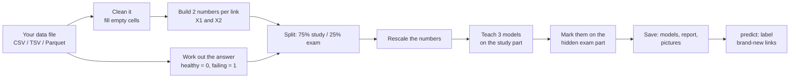

# How `linkfail` works — a plain-language guide

This guide explains the whole project from scratch. You do not need a machine-learning background.
Read it top to bottom once; afterwards use the table of contents to jump around.

**Contents**
1. [The problem in one minute](#1-the-problem-in-one-minute)
2. [The big picture](#2-the-big-picture)
3. [Step 1 – The raw data](#3-step-1--the-raw-data)
4. [Step 2 – Squeezing a link into two numbers](#4-step-2--squeezing-a-link-into-two-numbers)
5. [Step 3 – Labels: the "right answers"](#5-step-3--labels-the-right-answers)
6. [Step 4 – Cleaning: empty cells](#6-step-4--cleaning-empty-cells)
7. [Step 5 – Study set, exam set, and rescaling](#7-step-5--study-set-exam-set-and-rescaling)
8. [Step 6 – The three models](#8-step-6--the-three-models)
9. [Step 7 – Marking the exam (metrics)](#9-step-7--marking-the-exam-metrics)
10. [Reading the pictures](#10-reading-the-pictures)
11. [Using the model on new links (`predict`)](#11-using-the-model-on-new-links-predict)
12. [What happens during `train`, step by step](#12-what-happens-during-train-step-by-step)
13. [File-by-file map of the code](#13-file-by-file-map-of-the-code)
14. [Limits and honest caveats](#14-limits-and-honest-caveats)
15. [Glossary](#15-glossary)
16. [Frequently asked questions](#16-frequently-asked-questions)

---

## 1. The problem in one minute

Cloud companies move data over **long fibre-optic links** between cities and data centres. If a link
fails suddenly, customers lose service. But links usually **get sick before they die**: the signal
slowly weakens, amplifiers drift, and readings creep away from their normal values.

If we can spot a sick link **early**, engineers can reroute traffic and repair it before anyone notices.

`linkfail` does that spotting. You give it a table of past measurements where you know which links
were healthy and which were failing. It **learns the difference**, then can judge **new** links.

> In machine-learning words this is *binary classification*: for each link, answer "healthy (0)" or
> "not healthy (1)".

---

## 2. The big picture



The same story as a classroom analogy:

| In the project | Classroom analogy |
|---|---|
| Rows with known answers | Practice questions **with** the answer key |
| Train set (75%) | The questions the student studies from |
| Test set (25%) | The surprise exam: questions the student has never seen |
| Model | The student |
| Metrics | The exam marks |
| `predict` on new links | The student working in the real world |

---

## 3. Step 1 – The raw data

A long link is a chain of short pieces called **spans** (the paper uses 19 per link):

```
 transmitter ──[ fibre ]──▶(amplifier)──[ fibre ]──▶(amplifier)── ... ──▶ receiver
                 span 1                    span 2                          span 19
```

* **Fibre** weakens the light as it travels. The weakening is the **span loss** (in dB).
* An **amplifier** boosts the light again. The boost is the **amplifier gain** (in dB).
* Engineers know what each span *should* do: a **target span loss** and a **target gain**.

Every 2 minutes the network records, for each span, four numbers:

| Raw value | Meaning |
|---|---|
| `span_loss` | how much light the fibre is losing right now |
| `target_span_loss` | how much it is *supposed* to lose |
| `amp_gain` | how much boost the amplifier is giving right now |
| `target_gain` | how much boost it is *supposed* to give |

That is 19 spans × 4 values = **76 numbers per link per time slot**, plus an overall quality reading
called **OSNR** (optical signal-to-noise ratio; higher is better).

76 numbers is a lot to learn from. The next step shrinks it.

---

## 4. Step 2 – Squeezing a link into two numbers

The key insight of the paper: what matters is **how far each span is from normal**, not the raw
values themselves.

**Equation 1 – per-span differences**

```
x1 = amp_gain − target_gain             (is the amplifier giving more/less boost than planned?)
x2 = target_span_loss − span_loss       (is the fibre losing more light than planned?)
```

The order in `x2` is flipped on purpose, so that **for both numbers, "negative" means "worse than
planned"**.

**Equation 2 – add up all the spans**

```
X1 = x1(span 1) + x1(span 2) + ... + x1(span 19)
X2 = x2(span 1) + x2(span 2) + ... + x2(span 19)
```

### A worked example (3 spans instead of 19, to keep it small)

| | Span 1 | Span 2 | Span 3 |
|---|---|---|---|
| `amp_gain` | 20.1 | 18.9 | 21.0 |
| `target_gain` | 20.0 | 20.0 | 21.0 |
| **x1** = gain − target | +0.1 | **−1.1** | 0.0 |
| `span_loss` | 10.2 | 14.8 | 8.1 |
| `target_span_loss` | 10.0 | 12.0 | 8.0 |
| **x2** = target − loss | −0.2 | **−2.8** | −0.1 |

Adding across the spans:

* **X1 = 0.1 − 1.1 + 0.0 = −1.0**
* **X2 = −0.2 − 2.8 − 0.1 = −3.1**

Span 2 is clearly the troublemaker (its amplifier is under-delivering and its fibre is losing extra
light), and that shows up as strongly negative numbers. A perfectly healthy link would give
**X1 ≈ 0 and X2 ≈ 0**.

So this link becomes a single dot at **(−1.0, −3.1)** on a chart. Every link and every time slot is
one dot. Healthy links cluster near the centre; sick ones drift towards the bottom-left.

> **In the code:** `data.py → prepare_dataset()` (the loop under "Step 5"). In the settings file this
> is the `derived_features` section; the `*` wildcard means "all 19 span columns".

---

## 5. Step 3 – Labels: the "right answers"

To learn, the model needs examples **with the answer attached**: *this dot was a healthy link, this
other dot was a failing one.* That answer is the **label**: `0` = healthy, `1` = not healthy.

Where do labels come from? Different datasets do it differently, so the tool supports four ways:

| Your situation | What you write | Example |
|---|---|---|
| A column already contains 0 and 1 | nothing (it is the default) | `label` column with 0/1 |
| A column has words; you know which mean *failing* | `positive_labels: [failure, degraded]` | |
| A column has words; you know which mean *healthy* | `healthy_labels: [no-failure]` | everything else becomes "failing" |
| No label column, but you trust a measurement | `label_from_threshold: {column: osnr_db, below: 20}` | OSNR under 20 dB = failing |

The paper uses the last approach: OSNR below a limit means the link is unhealthy.

> **In the code:** `data.py → build_labels()`.

---

## 6. Step 4 – Cleaning: empty cells

Real instruments sometimes drop a reading, leaving an empty cell. Models cannot digest empty cells,
so the tool offers three choices (`missing:` in the settings):

| Choice | What it does | When to use |
|---|---|---|
| `interpolate` (default) | draws a straight line between the neighbouring rows and fills the gap | readings change smoothly over time (the paper's choice) |
| `median` | fills with the column's middle value | rows are unrelated to each other |
| `drop` | removes the row | you have plenty of data and few gaps |

Example of `interpolate`: values `1.0, (empty), 3.0` → the gap becomes `2.0`.

Because "neighbouring" only makes sense in time order, you can tell the tool to sort first
(`sort_by: timestamp`).

> **In the code:** `data.py → prepare_dataset()`, "Step 4".

---

## 7. Step 5 – Study set, exam set, and rescaling

### Splitting: never grade a student on questions they memorised

We hide **25%** of the rows (the **test set**) and let the models learn only from the other **75%**
(the **train set**). Afterwards we mark the models on the hidden part. If we marked them on the data
they studied, a model could score 100% just by memorising, and we would learn nothing about how it
behaves on new links.

* The split is shuffled randomly but **reproducibly** (`seed: 42`), so you get the same split each time.
* It is **stratified**: if 35% of all rows are failing, then about 35% of the train set *and* 35% of
  the test set are failing. Otherwise a rare class could end up missing from one part.

### Rescaling: put the numbers on the same footing

One feature might range in the thousands and another in decimals. Models learn faster and more
fairly when each feature is centred on 0 and has a typical size of about 1:

```
new_value = (value − average) / typical_spread
```

Example: the values `2, 4, 6` have average 4 and spread ≈ 1.63, so they become
`−1.22, 0, +1.22`.

**Important detail:** the average and spread are computed from the **train set only** and then reused
on the test set (and on any future data). Computing them from everything would let a little
knowledge of the exam leak into the studying and make the results look better than they truly are.

> **In the code:** `cli.py → run_training()` Steps 2–3; `data.py → Standardizer`.

---

## 8. Step 6 – The three models

All three are **linear**: in our two-number chart they separate healthy from failing with a **straight
line** (with more features: a flat plane). The tool trains all three so you can compare them. The
paper found that the dividing line really is nearly straight, so no fancier model was needed.

Each model produces a **score between 0 and 1**: close to 1 = "probably failing", close to 0 =
"probably healthy". The final answer is "failing" when the score is **0.5 or more**.

### 8.1 Logistic regression — "draw a line, convert distance into a probability"

1. Compute a **line score**: `z = w1·X1 + w2·X2 + b`. The weights `w1`, `w2` say how much each
   feature pushes towards "failing"; `b` shifts the whole thing.
2. Squash `z` into a probability with the **sigmoid** curve:

| z | −4 | −2 | 0 | +2 | +4 |
|---|---|---|---|---|---|
| probability of "failing" | 0.018 | 0.119 | 0.500 | 0.881 | 0.982 |

   `z = 0` means "right on the line, completely unsure". The further from the line, the more confident.
3. **Learning** means finding the `w1, w2, b` that make these probabilities match the known answers.
   "How wrong are we?" is measured by the **loss**; the best weights give the smallest loss.

**How it finds the best weights: Newton's method.** Picture standing on a foggy hillside, wanting
the lowest point of the valley. *Gradient descent* takes many small steps downhill. *Newton's method*
also senses how the slope is **curving**, so it can jump almost straight to the bottom. Here it
typically needs only **5–15 rounds**.

*A small safety feature:* if the two groups are perfectly separable, the maths would push the weights
towards infinity. A tiny penalty on large weights (`l2`) keeps everything stable without changing the
results noticeably.

### 8.2 GDA (Gaussian Discriminant Analysis) — "which cloud fits this dot better?"

1. Look at the healthy dots: they form a roughly round **cloud** with a centre.
2. Look at the failing dots: a second cloud with its own centre.
3. For a **new** dot, ask: *"which cloud would more likely have produced a dot right here?"*

"Gaussian" means each cloud is **bell-shaped**: dense in the middle, thinning outwards. We assume both
clouds have the same shape and spread, which gives a straight dividing line.

* **No repeated learning rounds.** The centres and spread are simple averages, computed in one go.
* **Strength:** excellent when the clouds really are bell-shaped.
* **Weakness:** if a class is oddly shaped (for example a mix of several kinds of failure), GDA's
  assumption is wrong and it does a bit worse. You can see this in the demo results.

### 8.3 Linear SVM (Support Vector Machine) — "the widest empty street"

Many straight lines can separate the two groups. The SVM picks the one with the **widest empty
street** around it, so it is as far as possible from both groups. A boundary that does not hug either
group is less likely to misjudge new links.

* Setting **C** controls strictness: large C = "no wrongly placed training dots allowed" (narrow
  street); small C = "allow a few mistakes for a wider street".
* We use scikit-learn's well-tested implementation; our class just wraps it to behave like the others.
* An SVM does not naturally give probabilities, so we squash its "distance from the line" with the
  sigmoid. Good for ranking and for the 0.5 cut-off, but not a true calibrated probability.

### Which one is best?

On the demo data, logistic regression and SVM tie and GDA is slightly behind, the same ordering as in
the paper. On **your** data the ranking may differ; that is exactly why the tool trains all three.

> **In the code:** `models.py` — `LogisticRegressionNewton`, `GDA`, `LinearSVM`.

---

## 9. Step 7 – Marking the exam (metrics)

Why not just report "accuracy" (share of rows classified correctly)? Because failures are **rare**.
If only 2 links in 100 fail, a lazy model that always says "healthy" scores **98%** while catching
**zero** failures. So we report four marks, all measured on the hidden test set.

### A worked example

Suppose the test set has 100 links, of which 10 are truly failing. The model flags 12 links as
failing; 9 of those flags are correct.

| | Model says **healthy** | Model says **failing** |
|---|---|---|
| **Truly healthy** (90) | 87 ✔ (true negatives) | 3 ✘ (false alarms) |
| **Truly failing** (10) | 1 ✘ (missed failure) | 9 ✔ (true positives) |

This 2×2 table is called the **confusion matrix**.

| Metric | Question it answers | Calculation | Result |
|---|---|---|---|
| **Accuracy** | out of everything, how many did we get right? | (87 + 9) / 100 | **0.96** |
| **Precision** | when we say "failing", how often are we right? | 9 / (9 + 3) | **0.75** |
| **Recall** | of the truly failing links, how many did we catch? | 9 / (9 + 1) | **0.90** |
| **F1** | one number balancing precision and recall | 2·9 / (2·9 + 3 + 1) | **0.82** |

The "always healthy" lazy model would have: accuracy 0.90, **recall 0.00**. Same-looking accuracy,
completely useless, which is why recall and precision matter.

* **Low precision** → many false alarms → wasted engineer time.
* **Low recall** → missed failures → customer outages. Usually the costlier mistake.
* **ROC-AUC** → pick one failing and one healthy link at random; how often does the model score the
  failing one higher? 1.0 = always, 0.5 = coin flip.

> **In the code:** `evaluate.py → compute_metrics()`.

---

## 10. Reading the pictures

After training you get four figures in `figures/`.

**`decision_boundaries.png`** (only when there are exactly two features)


Each dot is a link from the **test set**. Blue circles are truly healthy; orange crosses are truly
failing. The **black line** is where the model switches its verdict, and the tinted side is what it
calls "not healthy". Dots on the wrong side of the line are mistakes. Notice that the failing cloud
is spread out and not a neat round blob, which is why GDA's line sits slightly differently.

**`confusion_matrices.png`** — one 2×2 grid per model, exactly like the table in section 9. The
diagonal (top-left and bottom-right) shows correct answers; the darker, the more.

**`roc_curves.png`** — each curve shows catch-rate (up) against false-alarm-rate (right). A curve hugging
the **top-left corner** is excellent; the dashed diagonal is pure guessing.

**`metric_comparison.png`** — grouped bars to compare the models on accuracy, precision, recall and F1.


---

## 11. Using the model on new links (`predict`)

Once trained, the model is saved in `model.joblib`. This one file holds everything needed to judge
new data: the three models, the rescaling numbers, the feature recipe, and the settings.

```bash
python -m linkfail predict --model runs/exp1/model.joblib --data new_links.csv --output predictions.csv
```

What happens:

1. The saved package is opened.
2. Your new file goes through the **exact same** cleaning and feature recipe as the training data
   (that is why one shared function, `prepare_dataset`, handles both cases).
3. Numbers are rescaled with the **training** average and spread.
4. The model gives each row a score; ≥ 0.5 means "not healthy".

The output file has three columns:

| Column | Meaning |
|---|---|
| `row_index` | which row of **your** file this verdict belongs to |
| `unhealthy_score` | 0 to 1; higher = more likely failing (useful for ranking which links to inspect first) |
| `prediction` | `healthy` or `not healthy` |

New data does **not** need a label column; if you had the answers you would not need predictions.

---

## 12. What happens during `train`, step by step

When you run `python -m linkfail train --data my.csv --features X1 X2 --label label`, this is the
exact sequence (function names are in `linkfail/`):

| # | What happens | Where in the code |
|---|---|---|
| 0 | Combine defaults + your YAML + your flags into final settings; refuse nonsense | `config.py → load_config`, `validate_config` |
| 1 | Read the file | `data.py → load_table` |
| 2 | Sort, force numbers, fill gaps | `data.py → prepare_dataset` (steps 1–4) |
| 3 | Build features X1, X2 (Eq. 1 + 2) | `data.py → prepare_dataset` (step 5) |
| 4 | Work out 0/1 labels; drop rows with no label | `data.py → build_labels` |
| 5 | Split 75 / 25, stratified | `cli.py → run_training` (Step 2) |
| 6 | Learn rescaling from the train part; apply to both parts | `data.py → Standardizer` |
| 7 | For each model: learn on the train part | `models.py → fit()` |
| 8 | Mark each model on train **and** test | `evaluate.py → compute_metrics` |
| 9 | Save `model.joblib`, `metrics.json`, `report.md`, `config_used.yaml` | `cli.py → run_training` (Step 5) |
| 10 | Draw the four figures | `plotting.py` |

The numbers that matter most for judging quality are the **test** marks (step 8, second set). The
train marks are shown too: if train is far better than test, the model is memorising rather than
learning.

---

## 13. File-by-file map of the code

```
linkfail/
├── __init__.py       version number + a short map of the package
├── __main__.py       lets you type `python -m linkfail`
├── config.py         the instruction sheet: defaults, YAML loading, safety checks
├── data.py           the preparation room: read, clean, build features, build labels, rescale
├── models.py         the three brains: logistic regression, GDA, linear SVM
├── evaluate.py       the exam marker: metrics + the markdown report
├── plotting.py       the artist: all four figures
├── sample_data.py    the practice-data maker: realistic FAKE telemetry for the demo and tests
└── cli.py            the control panel: inspect / train / predict / demo

configs/              ready-to-copy settings files
tests/                29 automatic checks (run with `pytest`)
data/sample/          the bundled fake dataset
docs/                 this guide and the images
```

Every code file begins with a plain-language summary of its role, and every function and block
carries a comment explaining what it is for.

---

## 14. Limits and honest caveats

* **The demo numbers are not real results.** The paper's data is private, so the demo uses invented
  measurements. They prove that the program works, nothing more. Always train on your own data
  before drawing any conclusion about a real network.
* **Linear only.** If healthy and failing links cannot be separated by a straight line in your data,
  these models will struggle. A natural next step would be a non-linear model (for example an SVM
  with an RBF kernel), which the paper lists as future work.
* **Failure prediction, not localisation.** The tool says *whether* a link is sick; it does not say
  *which span* is at fault, although the per-span differences hold hints.
* **Rows are treated as independent.** There is no memory of earlier time slots, so a slow trend is
  only noticed once it is large enough to show up in a single reading.
* **Labels decide everything.** If your labels are noisy or defined badly (e.g. a poorly chosen OSNR
  limit), the model faithfully learns the noise.

---

## 15. Glossary

| Term | Plain meaning |
|---|---|
| **Span** | one short stretch of a link: fibre plus an amplifier |
| **Amplifier gain** | how much an amplifier boosts the light signal |
| **Span loss** | how much light the fibre absorbs along a span |
| **OSNR** | signal quality: strength of the signal compared with noise |
| **Feature** | an input number the model looks at (here: X1, X2) |
| **Label** | the known right answer for a row (0 healthy, 1 not healthy) |
| **Classifier** | a model that outputs a category instead of a number |
| **Train set / test set** | the study part / the hidden exam part of the data |
| **Standardise** | rescale numbers to average 0 and typical size 1 |
| **Weight (coefficient)** | how strongly one feature pushes the verdict |
| **Sigmoid** | the S-shaped curve that turns any number into 0–1 |
| **Loss** | a "how wrong are we" score that learning tries to minimise |
| **Newton's method** | a fast way to minimise a loss by using its slope *and* curvature |
| **Decision boundary** | the line where the model switches its verdict |
| **Confusion matrix** | the 2×2 table of right/wrong answers per class |
| **Precision / recall** | false-alarm control / missed-failure control |
| **YAML** | a simple human-readable settings-file format |

---

## 16. Frequently asked questions

**Why only two features?**
The paper summed 19 spans × 4 readings down to two meaningful numbers, which makes the problem easy to
draw and understand. The tool is not limited to two: give it more features and it works the same way
(only the decision-boundary picture is skipped, since a flat chart shows only two).

**Can I use my own columns instead of the paper's X1 and X2?**
Yes. Use `--features col1 col2 col3 ...` for ready-made columns, or `derived_features` in a YAML file
to calculate your own sums of differences. See `configs/`.

**My label has several failure types. What do I do?**
Collapse them into healthy vs not healthy with `healthy_labels: ["no-failure"]` (or whichever word
means healthy in your data). Everything else becomes "not healthy".

**One class is very rare. Is that a problem?**
It makes accuracy misleading, so look at precision, recall and F1 instead. The tool keeps the class
ratio equal across train and test (stratified split) so both parts contain some failures.

**Why does the tool train three models if one scores best?**
Different data suits different models, and comparing them is cheap. Agreement between independent
models also builds confidence that the result is real.

**How do I know the model isn't just memorising?**
Compare the train and test marks in `metrics.json`. A big gap (train much better than test) is the
warning sign.

**Where do I change the 75/25 split?**
`--test-size 0.2` on the command line, or `split: {test_size: 0.2}` in the YAML file.
